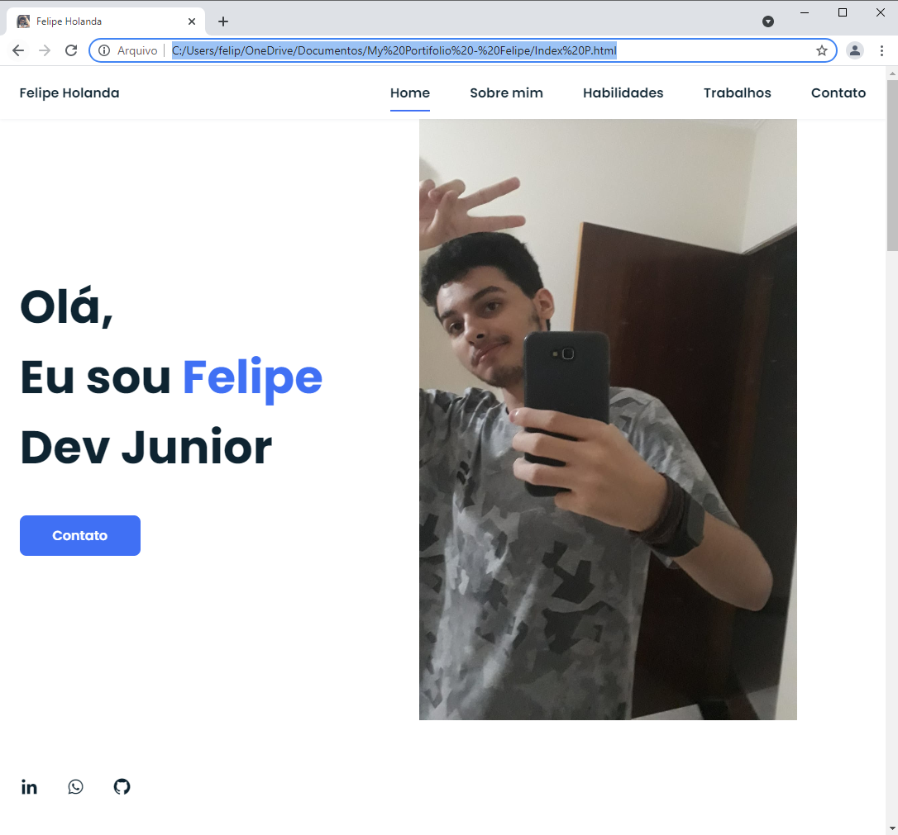

   

# 👨🏻‍💻 Sobre o Projeto

<h4>Site pessoal feito para poder descobrir um pouco mais sobre mim.</h4>

 

Esse projeto...

<a href="#sobre">Sobre</a> •
<a href="#Imagem">Imagem</a> •
<a href="#Tecnologias">Tecnologias</a> •
<a href="#Ferramentas">Ferramentas</a>

 
 

## Imagem

<h1 aling="center">
   
</h1>

  ### Tecnologias 🚀

  As seguintes ferramentas foram usadas na construção do projeto:

  - [x] **HTML**
  - [x] **CSS**
  - [x] **JS**
  - [x] **SCSS**

  #### Ferramentas

  - [**VS CODE**](https://code.visualstudio.com/)
  - [**BOOTSTRAP**](https://getbootstrap.com/)

 

  Made with 💜 by FELIPE HOLANDA 👋🏻 [See my Linkedin](https://www.linkedin.com/in/felipe-holanda-de-freitas-3a91281a2/)
  
 

   

